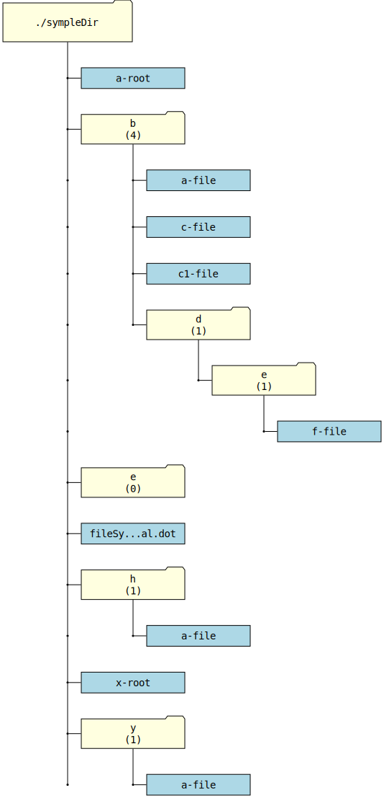

# FileSystemVisualizer

## Description

**FileSystemVisualizer** is a utility for creating a graphical representation of a file system in the **DOT** format (Graphviz).

The program recursively traverses the specified directory and generates a `.dot` file, which can be used to visualize the structure of files and folders.

## Features

-   Generation of a **DOT** file with a hierarchical representation of files and folders.
-   Support for node styling: files and folders are distinguished by different colors and shapes.
-   Truncation of long file and folder names for better readability.
-   Display of information about the number of files in a folder.

## Installation and Usage

### Requirements

-   **ts-node**
-   **Graphviz** (for visualization, optional)

### Installation

```sh
# Clone the repository
git clone https://github.com/mirninec/FileSystemVisual.git
cd FileSystemVisual

# Install TypeScript if it’s not installed globally
npm install typescript @types/node
```

### Running

```sh
ts-node index.ts [/path/to/folder]
```

If no folder path is specified, the program uses the current directory.

### Visualizing the Result

After running the command, a `fileSystemVisual.dot` file is created in the folder. You can visualize it using **Graphviz**:

```sh
dot -Tpng fileSystemVisual.dot -o fileSystemVisual.png
```

This file can be opened in any graphics editor.

## Examples

If the structure of the specified directory, as output by the **tree** command, looks like this:

```
.
├── a-root
├── b
│   ├── a-file
│   ├── c1-file
│   ├── c-file
│   └── d
│       └── e
│           └── f-file
├── e
├── fileSystemVisual.dot
├── fileSystemVisual.svg
├── h
│   └── a-file
├── x-root
└── y
    └── a-file

6 directories, 10 files
```

then the generated file after running the command:

```bash
ts-node index.ts
```

inside the target directory, followed by conversion with the command:

```bash
dot -Tsvg fileSystemVisual.dot -o fileSystemVisual.svg
```

in the same directory, will look like this:



## Project Structure

```
FileSystemVisualizer/
├── index.ts         # Main program file
├── README.md        # Project documentation
└── package.json     # Dependency information (if any)
```

## License

This project is distributed under the MIT License. See the [LICENSE](LICENSE) file for more details.

## Author

**mirninec** - [GitHub](https://github.com/mirninec)
