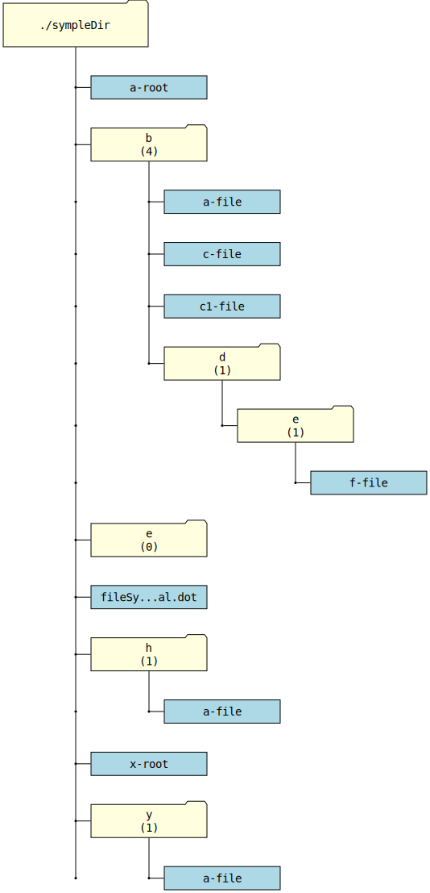

# FileSystemVisualizer

## Описание

**FileSystemVisualizer** — это утилита для создания графического представления файловой системы в формате **DOT** (Graphviz).

Программа рекурсивно обходит указанную директорию и генерирует `.dot`-файл, который можно использовать для визуализации структуры файлов и папок.

## Возможности

-   Генерация **DOT**-файла с иерархическим представлением файлов и папок.
-   Поддержка стилизации узлов: файлы и папки выделяются разными цветами и формами.
-   Обрезка длинных имен файлов и папок для лучшей читаемости.
-   Вывод информации о количестве файлов в папке.

## Установка и использование

### Требования

-   **ts-node**
-   **Graphviz** (для визуализации, опционально)

### Установка

```sh
# Клонируйте репозиторий
git clone https://github.com/mirninec/fileSystemVisual.git
cd FileSystemVisualizer

# Установите TypeScript, если он у Вас не установлен глобально
npm install typescript @types/node
```

### Запуск

```sh
ts-node index.ts [/путь/к/папке]
```

Если путь к папке не указан, программа использует текущую директорию.

### Визуализация результата

После выполнения команды в папке создается файл `fileSystemVisual.dot`. Его можно визуализировать с помощью **Graphviz**:

```sh
dot -Tpng fileSystemVisual.dot -o fileSystemVisual.png
```

Этот файл можно открыть в любом графическом редакторе.

## Примеры

Если структура указанной директории выведенная командой **tree** выглядит так

```
.
├── a-root
├── b
│   ├── a-file
│   ├── c1-file
│   ├── c-file
│   └── d
│       └── e
│           └── f-file
├── e
├── fileSystemVisual.dot
├── fileSystemVisual.svg
├── h
│   └── a-file
├── x-root
└── y
    └── a-file

6 directories, 10 files
```

то сгенерированный файл после выполнения команды

```bash
ts-node index.ts
```

внутри целевой директории и последующего преобразования командой

```bash
dot -Tsvg fileSystemVisual.dot -o fileSystemVisual.svg
```

там же, будет выглядеть так



## Структура проекта

```
FileSystemVisualizer/
├── index.ts         # Основной файл программы
├── README.md        # Документация проекта
└── package.json     # Информация о зависимостях (если появятся)
```

## Лицензия

Этот проект распространяется под лицензией MIT. См. файл [LICENSE](LICENSE) для получения дополнительной информации.

## Автор

**mirninec** - [GitHub](https://github.com/mirninec)
